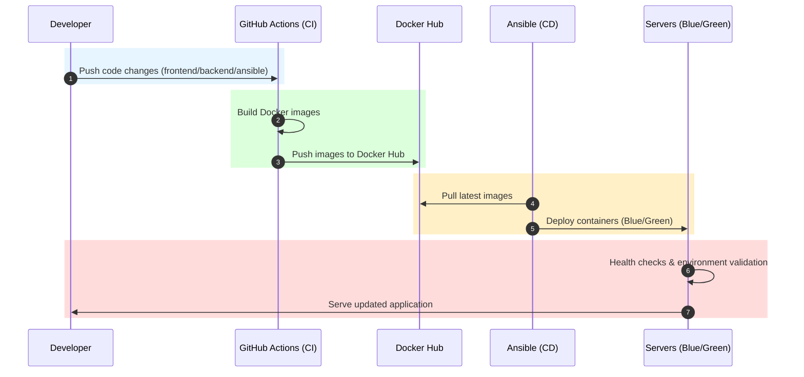
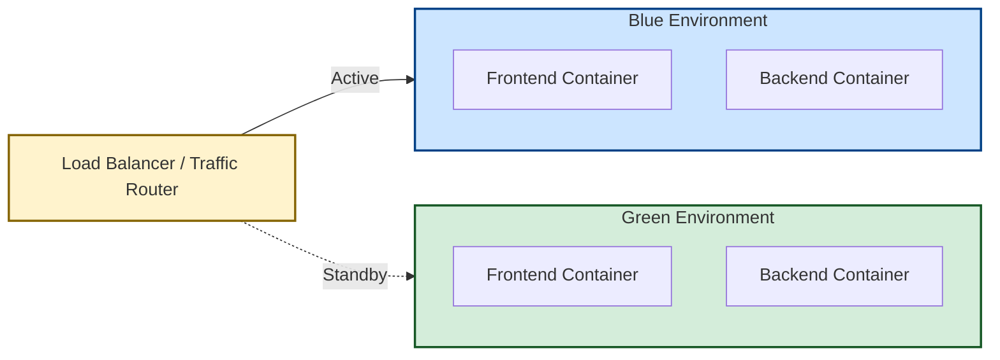
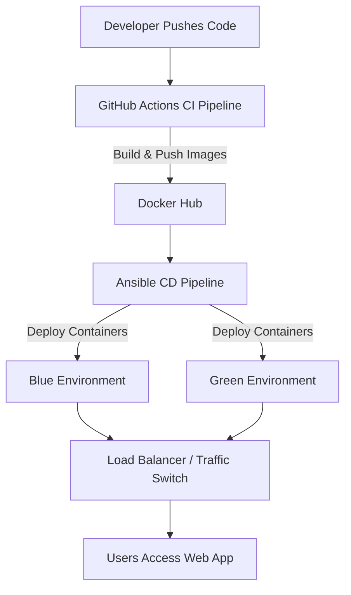

# 🌐 GitOps Web Server Deployment Project

This project demonstrates a **GitOps workflow** for deploying a web application across multiple servers with **zero downtime**. It combines **CI/CD pipelines, Docker, Ansible, and Blue‑Green deployment strategies** to ensure reliable, automated, and safe production releases.

## 🚀 Project Highlights
- **GitOps Workflow**  
  Designed and implemented a GitOps workflow with two pipelines:
  - **CI Pipeline**: Builds Docker images and publishes them to Docker Hub.  
  - **CD Pipeline**: Uses Ansible to deploy across multiple servers.

- **Blue‑Green Deployment**  
  Achieves zero‑downtime releases and enables safe rollbacks by maintaining two parallel environments (`blue` and `green`).

- **Automation & Reliability**  
  - Automated environment tracking.  
  - Health checks to validate deployments before switching traffic.  
  - Ensures smooth production transitions.


## 🛠️ Technologies Used
- **GitOps** – declarative, version‑controlled deployments  
- **Docker** – containerization of frontend and backend services  
- **Ansible** – automated configuration management and deployment  
- **CI/CD** – GitHub Actions pipelines for build and deploy  
- **Blue‑Green Deployment** – zero‑downtime release strategy  


## 🏗️ Architecture


The system is composed of the following components:

- **Developer Workflow**: Code changes pushed to GitHub (`frontend/`, `backend/`, or `ansible/`).  
- **CI Pipeline (GitHub Actions)**:  
  - Detects changes.  
  - Builds Docker images for frontend and backend.  
  - Pushes images to Docker Hub.  
- **CD Pipeline (Ansible)**:  
  - Pulls latest images from Docker Hub.  
  - Deploys containers to target servers.  
  - Manages Blue/Green environments for safe rollouts.  
- **Web Servers**:  
  - Run frontend (Nginx) and backend (Flask/Gunicorn).  
  - Traffic routed to the active environment (`blue` or `green`).  


## 📜 Sequence Diagram (Colored)



## 🟦🟩 Blue/Green Deployment Diagram




## 📂 Project Structure
```
.
├── backend/              # Backend service (Flask + Gunicorn)
├── frontend/             # Frontend service (Nginx + static files)
├── ansible/              # Playbooks and roles for deployment
├── .github/workflows/    # CI/CD pipeline definitions
└── README.md
```


## ⚙️ CI/CD Workflow
- **Trigger**: Runs on push to `main` branch when files in `backend/**`, `frontend/**`, or `ansible/**` change.  
- **Jobs**:
  - `backend-build`: Builds and pushes backend Docker image if backend changed.  
  - `frontend-build`: Builds and pushes frontend Docker image if frontend changed.  
  - `deploy`: Runs Ansible deployment if either build job succeeded.  
- **Manual Run**: Workflow can also be triggered manually via GitHub Actions UI.





## 🐳 Docker Images
- **Frontend**: `susheelthapaa/task-frontend:latest`  
- **Backend**: `susheelthapaa/task-backend:latest`

## 📦 Deployment
- **Blue/Green Strategy**:
  - Two environments (`blue` and `green`) run side by side.  
  - Traffic is switched to the active environment after successful deployment.
  - Old container are deleted after traffic is switched.
- **Ansible Playbook**:
  ```bash
  ansible-playbook -i ansible/inventory/hosts.ini ansible/playbooks/deploy.yml
  ```

## 🖥️ Infrastructure Notes
- We use a GitHub self‑hosted runner for deployment.
- Both master node and slave node are virtual machines (VMs).
- Each VM has two network interfaces:
- One for internet access.
- One dedicated for Ansible communication.
- Port forwarding is configured to access services from the host machine.
